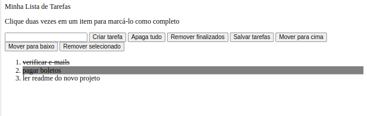

# Projeto Lista de Tarefas
 

 

---

# Sumário

- [Habilidades](#habilidades)
- [Requisitos do projeto](#requisitos-do-projeto)

    `Requisitos de base:`
    - [1 - Adicone à sua lista o título "Minha Lista de Tarefas" em uma tag <header>](#1---adicone-à-sua-lista-o-título-minha-lista-de-tarefas-em-uma-tag-)
    - [2 - Adicionar abaixo do título um pequeno e discreto parágrafo com id="funcionamento" e com o texto "Clique duas vezes em um item para marcá-lo como completo"](#2---Adicionar-abaixo-do-título-um-pequeno-e-discreto-parágrafo-com-idfuncionamento-e-com-o-texto-clique-duas-vezes-em-um-item-para-marcá-lo-como-completo)
    - [3 - Adicionar um input com o id="texto-tarefa" onde o usuário poderá digitar o nome do item que deseja adicionar à lista](#3---Adicionar-um-input-com-o-idtexto-tarefa-onde-o-usuário-poderá-digitar-o-nome-do-item-que-deseja-adicionar-à-lista)
    - [4 - Adicionar uma lista ordenada de tarefas com o id="lista-tarefas"](#4---Adicionar-uma-lista-ordenada-de-tarefas-com-o-idlista-tarefas)
    - [5 - Adicionar um botão com id="criar-tarefa" e, ao clicar nesse botão, um novo item deverá ser criado ao final da lista e o texto do input deve ser limpo](#5---Adicionar-um-botão-com-idcriar-tarefa-e-ao-clicar-nesse-botão-um-novo-item-deverá-ser-criado-ao-final-da-lista-e-o-texto-do-input-deve-ser-limpo)
    - [6 - Ordene os itens da lista de tarefas por ordem de criação](#6---ordene-os-itens-da-lista-de-tarefas-por-ordem-de-criação)
    - [7 - Clicar em um item da lista deve alterar a cor de fundo do item para cinza rgb(128,128,128)](#7---clicar-em-um-item-da-lista-deve-alterar-a-cor-de-fundo-do-item-para-cinza-rgb128128128)
    - [8 - Não deve ser possível selecionar mais de um elemento da lista ao mesmo tempo](#8---não-deve-ser-possível-selecionar-mais-de-um-elemento-da-lista-ao-mesmo-tempo)
    - [9 - Clicar duas vezes em um item, faz com que ele seja riscado, indicando que foi completo. Deve ser possível desfazer essa ação clicando novamente duas vezes no item](#9---clicar-duas-vezes-em-um-item-ele-deverá-ser-riscado-indicando-que-foi-completo-deve-ser-possível-desfazer-essa-ação-clicando-novamente-duas-vezes-no-item)
    - [10 - Adicionar um botão com id="apaga-tudo" que quando clicado deve apagar todos os itens da lista](#10---Adicionar-um-botão-com-idapaga-tudo-que-quando-clicado-deve-apagar-todos-os-itens-da-lista)
    - [11 - Adicionar um botão com id="remover-finalizados" que quando clicado remove **somente** os elementos finalizados da sua lista](#11---Adicionar-um-botão-com-idremover-finalizados-que-quando-clicado-remove-somente-os-elementos-finalizados-da-sua-lista)

    `Requisitos adicionais:`
    - [12 - Adicionar um botão com id="salvar-tarefas" que salve o conteúdo da lista. Se você fechar e reabrir a página, a lista deve continuar no estado em que estava](#12---Adicionar-um-botão-com-idsalvar-tarefas-que-salve-o-conteúdo-da-lista-se-você-fechar-e-reabrir-a-página-a-lista-deve-continuar-no-estado-em-que-estava)
    - [13 - Adicionar dois botões, um com id="mover-cima" e outro com id="mover-baixo", que permitam mover o item selecionado para cima ou para baixo na lista de tarefas](#13---Adicionar-dois-botões-um-com-idmover-cima-e-outro-com-idmover-baixo-que-permitam-mover-o-item-selecionado-para-cima-ou-para-baixo-na-lista-de-tarefas)
    - [14 - Adicionar um botão com id="remover-selecionado" que, quando clicado, remove o item selecionado](#14---Adicionar-um-botão-com-idremover-selecionado-que-quando-clicado-remove-o-item-selecionado)

# Habilidades utilizadas

- Manipular CSS

- Manipular Javascript

--- 

## Requisitos Obrigatórios:

### 1 - Adicionar à sua lista o título "Minha Lista de Tarefas" em uma tag <header>

- Verificar se sua página possui uma tag `header` com o conteúdo `Minha Lista de Tarefas`

### 2 - Adicionar abaixo do título um pequeno e discreto parágrafo com id="funcionamento" e com o texto "Clique duas vezes em um item para marcá-lo como completo"

- Verificar se existe na sua página um elemento com o id `funcionamento` com o conteúdo `Clique duas vezes em um item para marcá-lo como completo`

### 3 - Adicionar um input com o id="texto-tarefa" onde a pessoa usuária poderá digitar o nome do item que deseja adicionar à lista

- Verificar a existência de um elemento do tipo `input` com o id `texto-tarefa`.

### 4 - Adicionar uma lista ordenada de tarefas com o id="lista-tarefas"

- Verificar a existência de um elemento `ol` com o id `lista-tarefas`.

### 5 - Adicionar um botão com id="criar-tarefa" e, ao clicar nesse botão, um novo item deverá ser criado ao final da lista e o texto do input deve ser limpo

- Verificar a existência de um elemento do tipo `button` com o id `criar-tarefa`

- No campo de input será digitado o texto de uma tarefa qualquer e, em seguida, clicar-se-á no botão de criar tarefa. Verificar se, após o clique, o texto digitado aparece na lista e desaparece do input.

- A adição de elementos na lista poderá ser realizada várias vezes, checar se todos os itens criados permanecem na lista na medida em que novos são adicionados.

### 6 - Ordene os itens da lista de tarefas por ordem de criação

- Três itens poderão ser criados na lista, checar se eles estão ordenados por ordem de criação - ou seja, primeiro o primeiro item criado, depois o segundo, e assim por diante.

### 7 - Clicar em um item da lista deve alterar a cor de fundo do item para cinza rgb(128,128,128)

- Verificar se, ao se carregar a página, os itens da lista **não tem** o estilo CSS `background-color: rgb(128, 128, 128)`

- Verificar se, ao se clicar em um item da lista, ele passa a ter o estilo CSS `background-color: rgb(128, 128, 128)`

### 8 - Não deve ser possível selecionar mais de um elemento da lista ao mesmo tempo

- Verificar se, quando um elemento da lista é selecionado, o elemento selecionado previamente deixa de sê-lo. Isso é verificado através da presença ou não do estilo `background-color: rgb(128, 128, 128)` no elemento.

### 9 - Clicar duas vezes em um item, faz com que ele seja riscado, indicando que foi completo. Deve ser possível desfazer essa ação clicando novamente duas vezes no item

    Pontos importantes sobre este requisito:

    * Criar uma classe CSS com o nome "completed" e defina a propriedade "text-decoration" com o valor "line-through".

    * Utilizar a classe CSS "completed" para adicionar o efeito de letra tachada (riscada) às tarefas finalizadas.

- Verificar se, antes da ação ser disparada, o elemento adicionado à lista não tem nem a classe `completed` nem o estilo `line-through solid rgb(0, 0, 0)`.

- Verificar se a ação pedida é disparada mediante duplo clique no elemento da lista e que os elementos da lista completos tem em si a classe `completed` e a propriedade `text-decoration` com o valor `line-through solid rgb(0, 0, 0)`

- Verificar se, com um segundo duplo clique, um elemento completo deixa de sê-lo

### 10 - Adicionar um botão com id="apaga-tudo" que quando clicado deve apagar todos os itens da lista

- Verificar se existe um elemento `button` com o id `apaga-tudo`

- Verificar se, dado que uma lista possui tarefas, um clique no botão a deixa vazia

### 11 - Adicionar um botão com id="remover-finalizados" que quando clicado remove **somente** os elementos finalizados da sua lista

- Verificar se existe um elemento `button` com o id `remover-finalizados`

- Verificar se, ao clicar no botão, todos os elementos marcados como feitos são removidos da lista

## Requisitos adicionais

### 12 - Adicionar um botão com id="salvar-tarefas" que salve o conteúdo da lista. Se você fechar e reabrir a página, a lista deve continuar no estado em que estava

- Verificar se existe um elemento `button` com o id `salvar-tarefas`

- Verificar se, quando a lista tiver vários elementos, alguns dos quais marcados como finalizados, um recarregamento da página mantém a lista exatamente como está.

### 13 - Adicionar dois botões, um com id="mover-cima" e outro com id="mover-baixo", que permitam mover o item selecionado para cima ou para baixo na lista de tarefas

    Pontos importantes sobre este requisito adicional:

    * Antes de começar a desenvolver essa funcionalidade, pare e pense. O que significa mover um item de uma lista para cima ou para baixo no **_DOM_**? Você já possui todas as habilidades necessárias para fazer isso.

    * Tomar atenção quanto a várias maneiras de uso da aplicação. O que acontece se o usuário tentar mover o primeiro item para cima ou o último para baixo?

- Verificar a existência de dois elementos `button`, um com o id `mover-cima` e o outro com o id `mover-baixo`

- Verificar se, dado que diversos elementos foram acrescentados à lista, movimentá-los de formas diversas os deixa nas posições esperadas

- Verificar se, caso algum elemento esteja finalizado, este status deve persistir ainda que se mova o elemento

- Verificar se, caso nenhum elemento esteja selecionado, clicar nos botões não altera a lista

- Verificar se um elemento que esteja selecionado deve se manter selecionado mesmo depois de movido

- _Caso especial!_ Verificar se, caso se tente subir o elemento no topo da lista ou, caso se tente descer o último elemento da lista, esta não deve ser alterada

### 14 - Adicionar um botão com id="remover-selecionado" que, quando clicado, remove o item selecionado

- Será verificada a presença de um elemento `button` com um id `remover-selecionado`

- Verificar se, no clicar no botão, somente o elemento selecionado é removido

---
